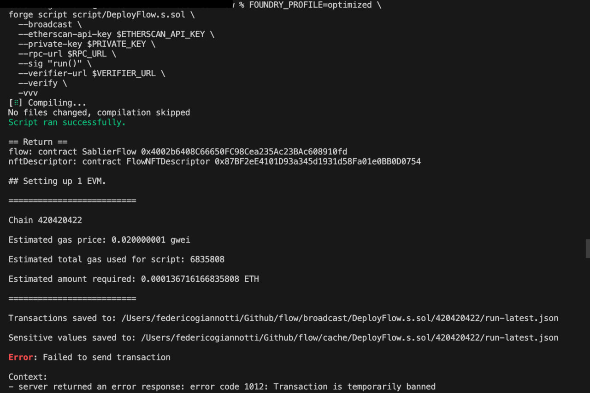

# Sablier/Flow x Polkadot

## Project description

In this project we decided to migrate [Sablier/Flow](https://github.com/sablier-labs/flow) contract on Polkadot Testnet Paseo as part of the [Polkadot Porting Existing Smart Contracts](https://ethrome25.notion.site/Prizes-and-Bounties-160d00c099af81aba88cd436e7acf94f) track of [EthRome2025](https://www.ethrome.org/).

## Comparative Analysis

Functionalities of [v1.1.1](https://github.com/sablier-labs/flow/releases/tag/v1.1.1) are entirely preserved and migrated.

## Working Deployment

### Verify FlowNFTDescriptor Contract

Explorer link: https://blockscout-passet-hub.parity-testnet.parity.io/address/0x87BF2eE4101D93a345d1931d58Fa01e0BB0D0754

```bash
npx hardhat verify --network passet-hub 0x87BF2eE4101D93a345d1931d58Fa01e0BB0D0754
```

### Verify SablierFlow Contract

Explorer link: https://blockscout-passet-hub.parity-testnet.parity.io/address/0x4002b6408C66650FC98Cea235Ac23BAc608910fd

```bash
npx hardhat verify --network passet-hub 0x4002b6408C66650FC98Cea235Ac23BAc608910fd 0xb1bEF51ebCA01EB12001a639bDBbFF6eEcA12B9F 0x87BF2eE4101D93a345d1931d58Fa01e0BB0D0754
```

### Setup instructions

#### Install dependencies

```bash
bun install
```

#### Wallet setup

you need a wallet to deploy the contracts.

```
bun add viem --dev
bun run generate-wallet
```

Take the address in the console and use it in the [fauced](https://faucet.polkadot.io/) to get founds on Paseo testnet.

Take the private key and create a `.env` file folliwing the `.env.example` style and replace the `PRIVATE_KEY=<generated-private-key>` with the private key and `ETH_FROM=<generated-wallet-address>`.


#### Compile contract

```bash
bun hardhat:compile
```

#### Deploy

```bash
bun hardhat:deploy --network passetHub
```

Make sure your `.env` file is filled.
```bash
ETH_FROM="generated-address"
ETHERSCAN_API_KEY="passet-hub"
PRIVATE_KEY=<generated-private-key>
RPC_URL="https://testnet-passet-hub-eth-rpc.polkadot.io"
VERIFIER_URL="https://blockscout-passet-hub.parity-testnet.parity.io/api/eth-rpc"
```

Deploy script result:
```bash
$ bun hardhat:deploy --network passetHub
$ hardhat run scripts/deploy-flow.ts --network paseoAssetHub
🚀 Starting Sablier Flow deployment...
🌐 Network: paseoAssetHub (Chain ID: 420420422)
👤 Admin address: 0xb1bEF51ebCA01EB12001a639bDBbFF6eEcA12B9F
🔑 Deployer address: 0xcD838Bff7285Ba64601d0bAD4FCAc1C1Bcf46B56
💰 Deployer balance: 4984.3740676288 ETH

📦 Deploying FlowNFTDescriptor...
📦 Deploying FlowNFTDescriptor...
⏳ Deploy FlowNFTDescriptor...
✅ Deploy FlowNFTDescriptor completed in block 1816275
   Gas used: 2606344840
   Transaction hash: 0x755d5f24086a2d1b40ba4d91fde5c3b4b244cb649c172991b4d7719f7b1ecc1f
📍 FlowNFTDescriptor deployed at: 0x87BF2eE4101D93a345d1931d58Fa01e0BB0D0754

📦 Deploying SablierFlow...
📦 Deploying SablierFlow...
⏳ Deploy SablierFlow...
✅ Deploy SablierFlow completed in block 1816276
   Gas used: 22487398620
   Transaction hash: 0x74c41be6c638e3a748144f4f996f7731316af9cf0ab0feccb5a54be5ca357fd8
📍 SablierFlow deployed at: 0x4002b6408C66650FC98Cea235Ac23BAc608910fd
```

Note: the admin address used was the default one provided by `sablier:  0xb1bEF51ebCA01EB12001a639bDBbFF6eEcA12B9F`. 

#### Link to source smart contracts source code

[sablier/flow](https://github.com/sablier-labs/flow)

#### Porting process documentation

The strategy we adopted:

We thought to start porting contracts in the following order on local development. Due to heavy local development process we decided to do the porting directly on devnet. We started deploying contracts using the `foundry` existing setup following the [polkadot foundry documentation](https://docs.polkadot.com/develop/smart-contracts/dev-environments/foundry/). 


We started installing `foundryup-polkadot` and setting up the `foundry.toml`. 

We where compiling using:
```bash
forge build --resolc
```
We where testing the deployment using: 
```bash
FOUNDRY_PROFILE=polkadot forge create FlowNFTDescriptor \
  --rpc-url $PASEO_RPC_URL \
  --private-key $PASEO_PRIVATE_KEY \
  --resolc \
  --json \
  --broadcast
```
The FlowNFTDescriptor contract was [deployed correctly](https://blockscout-passet-hub.parity-testnet.parity.io/address/0x4398308aAE99EA7F6532BF08D1C4585D8c00223b?tab=contract), 
But the verify part with the command: 
```bash
forge verify-contract \
  --rpc-url <rpc_https_endpoint> \
  <address> \
  <contract_file>:<contract_name> \
  --verifier blockscout \
  --verifier-url <blockscout_homepage_explorer_url>/api/
```
was not working.

SablierFlow was not working.

We found this [Sablier flow custom deployment guide](https://docs.sablier.com/guides/custom-deployments#flow-deployment). So we checked out to `v1.1.1` tag and following the same guide using `foundry` but we got stuck with this error.



At this point we decided to speak with Polkadot team and they told that `foundry` deployment was not yet ready and to switch to `hardhat`. So we:

1. Installed `hardhat` and created `hardhat.config.ts`.
2. Compiled the project
3. Made the [new deployment script with hardhat](./scripts/deploy-flow.ts)

And the deployment succeed.

## Feedbacks

One of the biggest difficulties we encountered was not having the `foundry compiler` implementation ready. Foundry is one of the most popular and effiecient complier on the market ad the moment and have that implementation fully functional would accellerate the processes of migrating existing EVM contracts on Polkadot.